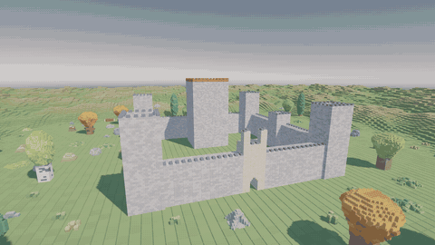

# Castle Smashers

A free-time project, written together with [Claude Code](https://claude.com/claude-code): a rigid-body physics engine that runs
entirely on the GPU inside Unity, and castles built from tens of thousands of construction bricks to break with it. The solver is
[Augmented Vertex Block Descent](https://graphics.cs.utah.edu/research/projects/avbd/) (Giles, Diaz, Yuksel, SIGGRAPH 2025) in
compute shaders; the castles are planned on the stud grid of a toy brick, snapped together with breakable joints, and stand on
hills with trees and bushes made of the same bricks. Everything else grew out of wanting to knock them down: cannonballs, sieges
with archers, mages and trebuchets, and mining charges.

## The Royal citadel undermined



[Full-quality video (1080p, 28 s)](docs/undermining.mp4) · [poster](docs/undermining.jpg)

<!--
To show the video as an inline player instead of the GIF, open this file in GitHub's web editor, drag docs/undermining.mp4
onto the editor: GitHub uploads it and inserts a https://github.com/user-attachments/assets/... line, which renders as a
player. (A video file inside the repository is not embedded by the README renderer, only linked.)
-->

The clip is the castle demo's largest preset, the Royal citadel — 34 477 bricks snapped together by 291 840 joints, 86 m square
at the demo's scale, with twenty trees and a hundred and twenty clumps of foliage of another 32 000 pieces asleep around it,
66 641 bodies in all — undermined by eleven mining charges under the two corner towers nearest the camera and under the keep.
Every charge breaks the snaps within its radius, throws the nearby bricks and digs a crater into the plateau, so that whatever
stood on the crater drops into it; each tower keeps its footing only along the wall farthest from the camera and topples towards
it. Nothing is animated: every brick is a body of the solver, every crack a snap joint breaking under the bending load, and the
rubble comes to rest and falls asleep on its own. The footage is the simulation at half speed (the solver's 60 steps per second
played back at 30), captured frame by frame from the player with `Tools/video/record_undermining.ps1`; the charges are listed in
[`Tools/video/undermining.txt`](Tools/video/undermining.txt).

## What is inside

The documentation of the engine lives next to the code: [Assets/Phys/README.md](Assets/Phys/README.md) (the API, the demos,
parameters, measured behaviour, tests), [ALGORITHMS.md](Assets/Phys/ALGORITHMS.md) (how the serial reference became a GPU
pipeline) and [BRICK_ASSEMBLY.md](Assets/Phys/BRICK_ASSEMBLY.md) (the JSON format the castles and trees are exchanged in). In
short:

### The solver

* **Augmented Vertex Block Descent on the GPU.** A step of the reference implementation
  ([avbd-demo3d](https://github.com/savant117/avbd-demo3d)) is reproduced as a sequence of compute dispatches recorded once into a
  command buffer and replayed every step: the hot list of bodies to visit, the broadphase (a uniform grid with an owner-cell rule
  and a list for bodies larger than the cells), the narrowphase (the reference's box-box clipping with persistent manifolds keyed by
  contact features, so the multipliers warm-start from the last step), the constraint lists, a graph colouring of the constraint
  graph, then the colour-batched primal sweeps — every body of a colour takes its 6 × 6 Newton step in parallel while the others
  hold still — interleaved with the dual updates of the penalties and multipliers, and finally the velocities. Every
  count-dependent dispatch is indirect, so nothing is read back to drive the step, and the renderer draws straight from the
  solver's buffers. Two runs are bitwise identical.
* **Verified against a line-for-line C# port of the reference.** The port is the oracle of the test suite: on the reference
  scenes the GPU matches it to rounding (a dropped box to 1e-7 after 120 steps, stacks and friction to 1e-5 .. 1e-3, a pyramid
  to 1e-2 after 30 steps, where the remaining difference is the Gauss-Seidel order), the narrowphase reproduces the reference's
  contacts on random box pairs, and the broadphase produces exactly the brute-force pair set.
* **Contacts, joints, springs, drives.** Frictional contacts with the paper's penalty ramp and stabilisation; ball-socket joints
  with angular locks and fracture, extended with *snap* limits (a joint breaks when pulled apart along an axis, sheared across it,
  or separated past a distance — four of them hold every brick-on-brick overlap of a castle); springs; driven bodies (external
  forces, velocity motors, heading-locked or kinematic orientation) for units; body pools with contact events for projectiles;
  blasts that toss bodies and break joints within a radius.
* **A heightfield terrain** as one static body slot: every box samples 26 lattice points against the surface and the deepest
  eight become one manifold with feature keys, so warm starting and sticking friction work as on a box. The field is generated,
  imported from a Unity terrain or a heightmap, levelled into plateaus for the castles, and edited at run time (the craters).
* **Sleeping and large worlds.** A body rests when it stays within 2 cm of a rest anchor for half a second and sleeps when
  everything two hops around it rests too; islands are labelled on the GPU so that a fast touch wakes a whole structure in the
  same step while a slow one wakes one body. Sleepers leave the hot list entirely: their contacts are frozen in a cold store and
  they sit in a sleeping grid of their own, so a world can hold far more bodies than it simulates at once (`ForBodies(262144,
  65536)`: room for 262 144 bodies, 65 536 awake). Seven Strongholds of 17 k bricks each plus one on the hills — 140 k bodies —
  step in 0.8 ms while asleep and 1.1 ms after a cannonball wakes one.

### Rendering

Instanced draws directly from the solver's position and rotation buffers — the collision boxes, or any mesh for a range of
bodies (the brick, the 27 construction pieces, the figures) — with per-body tints, shadows cast from the collision boxes instead
of the studded meshes (a shadow map draws every body once per cascade), and per-range bounds reduced on the GPU so that Unity
culls each range against the frustum and the shadow cascades. The terrain is drawn either with Unity's terrain renderer or as
42 k bevelled tiles from an instance buffer; weapons, projectile tips and effects are attached to bodies in the vertex shader,
with no frame of lag.

### The castles and what stands around them

* **A castle planner on the stud grid** (`BrickCastle`): English-bond curtain walls, hollow ring towers whose two course patterns
  are rotated copies of each other, a corbelled gatehouse, a keep, merlons, stairs — ten presets from an outpost of 1 001 bricks
  to the Royal citadel of 34 477. The plans grow in footprint and thickness rather than height, because a dry-stacked column
  leans once it is much taller than it is wide.
* **Bricks at 5 × model scale, a quarter to one kilogram each**, so that they sit in the regime the reference's penalty ramp is
  tuned for; the collision box is the brick without its studs, one collision margin taller, so stacked models meet with neither gap
  nor overlap.
* **A brick-assembly JSON format** and a 27-piece construction pack (bricks, plates, tiles, slopes, prisms; low-poly models
  generated in Blender) in which castles, trees and foliage are described and exchanged with other agents — with a loader that
  reports what rests on nothing, a re-bonding tool that re-tiles an agent's design course by course so that the seams avoid the
  seams below, and generators for six kinds of tree (designed under a corbel rule: a course may reach one stud beyond the course
  below) and twenty kinds of foliage.
* **The siege**: two armies of unit archetypes in body pools (archers with plain and explosive arrows, fire and frost mages with
  homing spells, trebuchets that swing and lob rocks), a garrison placed on the castle's occupancy map, formations, cooldown shots
  aimed by an implicit-Euler ballistics solver, impacts as blasts, and the player's move and attack orders.

### Numbers

On an RTX 4070 Laptop GPU (D3D12), solver step only: the 16-row pyramid of 137 boxes 1.5 ms (the fixed cost of ~200 dispatches);
a 22 141-box pyramid 6.5 ms at 10 iterations, 3.8 at 4; a 50 001-box pile 3.6 ms; a 73 811-box pyramid 17 ms at 4 iterations; the
Stronghold of 17 129 snapped bricks 4.4 ms awake and 0.77 ms asleep. The Royal citadel of the clip with its trees and foliage
(66 641 bodies) renders at 79 fps in the castle player at 1600 × 900 while it stands.

### Size

About 17 000 lines of C# (the solver, its CPU reference, the scenes, rendering and siege, the demos, 161 tests) and 4 600 lines
of HLSL in twelve compute shaders and four shaders, plus 2 000 lines of Python tools that generate the models and design the
trees, in some fifty commits over the course of a week.

## Running it

Unity 6000.3.12f1 with URP on Windows (D3D12). Open a scene in `Assets/Phys/Demo` and press Play,
or build a player from the `Phys` menu:

| Scene | What it shows |
|---|---|
| `Demo.unity` | the reference scenes (stacks, ropes, bridges, a breakable chain, pyramids of 22 k and 74 k boxes, a pile of 50 k) |
| `Castle.unity` | the ten planned castles on hills with trees and foliage; `J` snaps the bricks, `B` fires a cannonball, `O` builds sleeping copies around |
| `Preview.unity` | castles and trees described as brick-assembly documents |
| `Siege.unity` | a castle under siege: left click selects a kind of unit, right click orders a move or an attack |

Keys `1`-`0` choose a scene, `R` rebuilds it, `Space` pauses, `F1`/`F2`/`F5` show contacts, colours and joints, the right mouse
button orbits; the full list is in the HUD. Players take flags for scripted runs (`-avbd-scene`, `-avbd-snap`, `-avbd-screenshot`,
`-avbd-bench`, camera, `-avbd-record` for a frame sequence, `-avbd-blasts` for a charge script, ...) — see the engine README.

```
.\RunTests.ps1                          # EditMode + PlayMode (the editor must not have the project open)
.\Tools\video\record_undermining.ps1 -Build   # rebuilds the castle player, records the clip and encodes it (needs ffmpeg)
```

## Layout

```
Assets/Phys/AvbdGpu/Runtime         the GPU world, buffers, the command-buffer pipeline, the compute shaders
Assets/Phys/AvbdGpu/Reference       the C# port of avbd-demo3d (the test oracle)
Assets/Phys/AvbdGpu/Scenes          the scene catalog, the heightfield, the castle planner, the brick-assembly loader
Assets/Phys/AvbdGpu/Presentation    the instanced renderer, attachments, the terrain view and tiles
Assets/Phys/AvbdGpu/Siege           unit archetypes, the battle, formations, ballistics, the siege configs
Assets/Phys/AvbdGpu/Tests           EditMode and PlayMode tests
Assets/Phys/Demo                    the four scenes and their demos, the player build
Assets/Resources                    castles, trees, foliage and siege configs as data
Assets/Models                       the brick, the construction pack, the figures and weapons (all generated by scripts)
Tools                               the model generators, the re-bonding tool, the tree and foliage designers, the video script
docs                                the clip above
```

## Credits

The algorithm and its reference implementation are Chris Giles's, Elie Diaz's and Cem Yuksel's
([paper and project page](https://graphics.cs.utah.edu/research/projects/avbd/), [avbd-demo3d](https://github.com/savant117/avbd-demo3d),
MIT); everything here was written with Claude Code.
